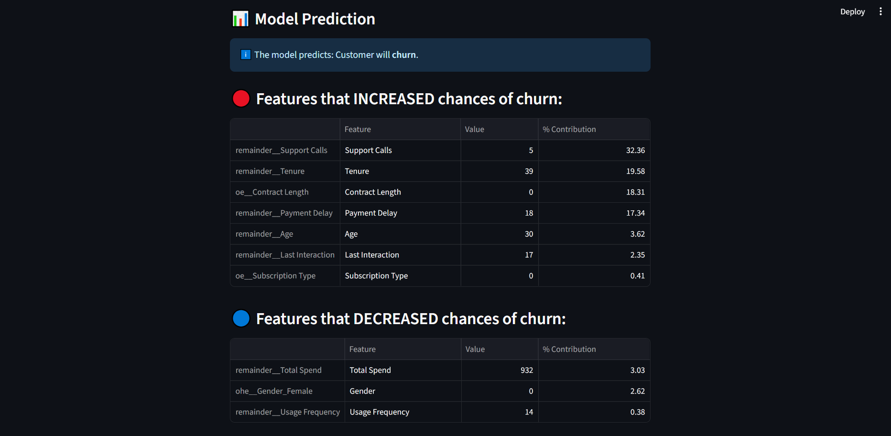
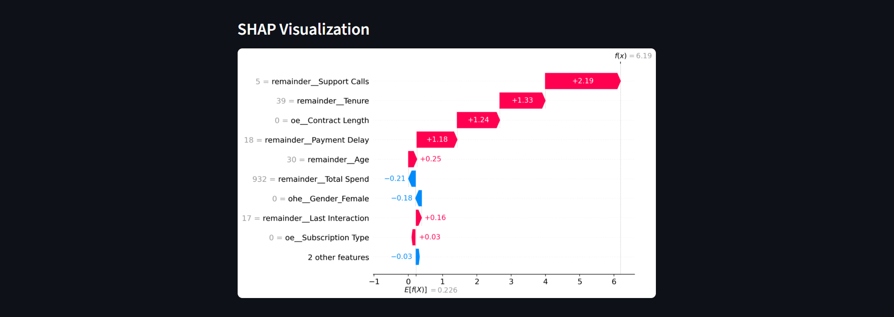

# 📉 Customer Churn Prediction with Explainable AI (XAI)

Predicting customer churn helps businesses retain valuable users and reduce revenue loss. This project leverages machine learning to predict customer churn and integrates **Explainable AI (XAI)** techniques to interpret the model's decisions.

---

## 🚀 Overview

In this project, we:
- Perform end-to-end **data preprocessing**.
- Train multiple **ML models** for churn prediction.
- Use **SHAP** (SHapley Additive exPlanations) and **LIME** (Local Interpretable Model-agnostic Explanations) for model explainability.
- Visualize key insights to drive business decisions.

---

## 📁 Project Structure

README.md - Project documentation || 
images/ = Folder containing output plots and SHAP visualizations 
requirements.txt - List of required Python libraries || 
CustomerChurn.ipynb - Main notebook containg all visualizations, model training and full ML pipeline  || 
model.pkl - Contained trained ML model || 
app.py - Streamlit app with SHAP visualizations

---

## 🧠 Machine Learning Algorithms Used

- Logistic Regression
- Decision Tree
- Random Forest
- XGBoost
- LightGBM

The best-performing model is selected based on cross validation score.

---

## 📊 Evaluation Metrics

- Accuracy
- Precision, Recall, F1-Score
- Confusion Matrix

> ✅ Achieved an accuracy of **~93%** and using the XGBoost classifier.

---

## 💡 Explainable AI (XAI)

To ensure **trust and transparency**, we used:

### ✅ SHAP
- Global feature importance
- Individual prediction explanations

### ✅ LIME
- Local interpretations
- Explains what influenced a particular prediction

---

## 📌 Key Insights

- Support calls, Monthly Charges, and Contract Type were the most influential features.
- Customers with **month-to-month contracts**, **high charges**, and **low tenure** were more likely to churn.

---

## 🛠️ Installation

Clone the repo and install dependencies:

```bash
git clone https://github.com/rajjaiswal/Telecom-CustomerChurn-Prediction.git
cd Telecom-CustomerChurn-Prediction.git
pip install -r requirements.txt
```


▶️ How to Run
1. Launch Jupyter Notebook:
```bash
jupyter notebook CustomerChurn.ipynb
```

2. Open CustomerChurn.ipynb :

   Run the cells in order to see analysis, model, performance.

3. Run Streamlit App:
   ```bash
   streamlit run app.py
   ```


🧪 Requirements
  • Python 3.8+

  • pandas, numpy, scikit-learn

  • matplotlib, seaborn

  • xgboost, lightgbm

  • shap, lime


Install via:

```bash
pip install -r requirements.txt
```


📎 Dataset
The dataset used is publicly available from the Telco Customer Churn Dataset on Kaggle.


📸 Sample SHAP Plot


📢 Conclusion
This project demonstrates not only how to predict churn using robust ML techniques but also how to interpret and explain predictions, empowering data-driven and transparent business decisions.

🤝 Let's Connect
Made with ❤️ by Raj Jaiswal

📄 License
This project is licensed under the MIT License.
